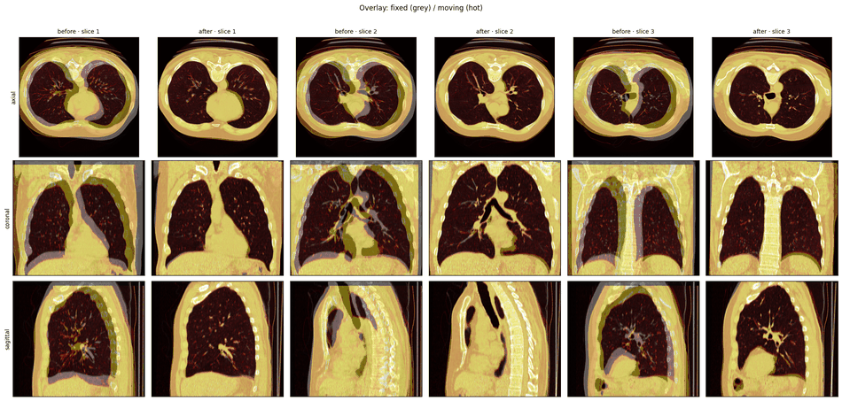
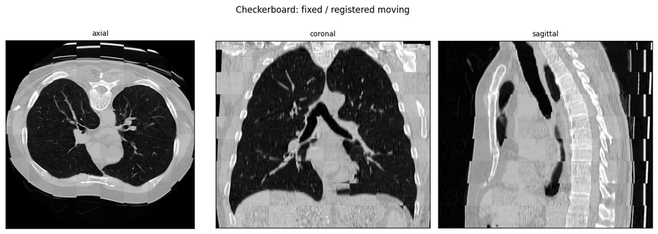
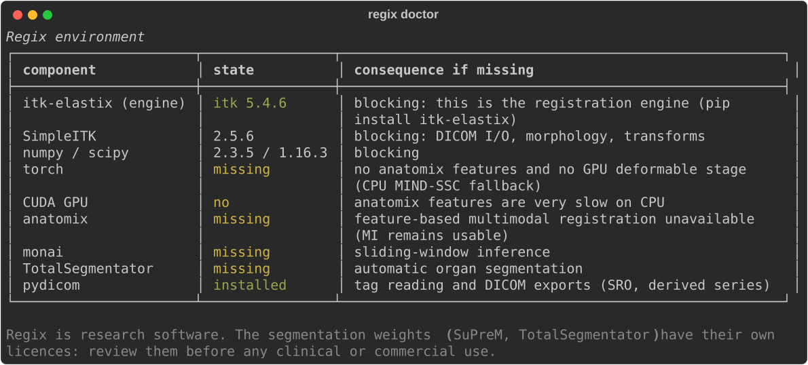
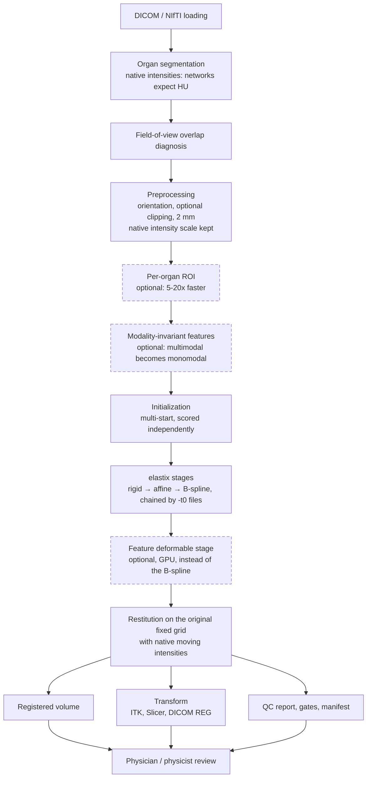

# Regix

## Multimodal, Multi-Organ Medical Image Registration With elastix


This project provides a pipeline for registering medical image volumes across
modalities and around specific organs. It enables:
- Reading DICOM series or NIfTI volumes, with geometry and acquisition checks
- Rigid, affine and deformable registration driven by elastix, optionally on
  modality-invariant features so that CT against MR behaves like a monomodal pair
- Organ-aware initialization, criterion masking and ROI cropping
- Generation of a quality-control report, acceptance gates and a run manifest
- Export of the transform back into the imaging information system (ITK, 3D Slicer,
  DICOM registration object, derived DICOM series)

**Clinical workflow:**
1. Inventory the DICOM study and pick the fixed and moving series
2. Segment the target organs, or reuse existing contours
3. Register, starting from an organ-aware initialization
4. Measure the result against landmarks, organ overlap and field plausibility
5. Review the report, then send the transform to the workstation or planning system

> **Example use case: liver follow-up CT, and abdominal MR fused onto CT**

> ⚠ **Not a medical device.** Regix is research software. It has not been cleared or
> approved by any regulatory authority. No clinical decision should rest on its
> outputs without review by a qualified operator and validation on the data of the
> deploying site. See [LICENSE](LICENSE).

## What a run produces

A run delivers three things: the **registered volume** on the original fixed grid and
in its original Hounsfield units, the **transform** in four formats (including a DICOM
Spatial Registration Object a planning system can consume), and the evidence needed to
judge them — a `run_manifest.json` plus a self-contained `report.html`.

The report is what a reviewer opens: verdict at the top, then the two reading modes.
Fixed image in grey, moving in hot, before and after registration:



The checkerboard is the complementary view — it exposes discontinuities at the
seams that an overlay hides:



The report also carries per-organ Dice, the Jacobian of the field, the acceptance gates
and the full environment.

## Why this exists

Registration libraries give you an optimiser. Getting from an optimiser to something
usable in an imaging department means solving a different set of problems: which DICOM
series in that folder, what happens when the fields of view barely overlap, how do I
know the result is not silently wrong, and how does the transform get back into the
PACS or the treatment planning system.

Regix is the layer around elastix that answers those questions, with three design
commitments:

1. **The output keeps its Hounsfield units.** The volume delivered is reconstructed
   from the *original* moving image onto the *original* fixed grid. Preprocessing
   (orientation, optional clipping, 2 mm working resolution) exists only to help the
   optimiser and never reaches the output. And what reaches elastix keeps the
   acquisition scale too — see [Native intensities](#native-intensities-reach-elastix).
2. **Quality control is independent of the optimised criterion.** An optimiser's
   internal score is computed on a subsample, at the working resolution, with exactly
   the criterion it was optimising. Using it to judge the result is marking your own
   homework.
3. **A failure is labelled, never hidden.** A case that does not clear its acceptance
   gates is marked `FAIL` with the measured value, the threshold and the reason. It is
   not replaced by a silent fallback, because a degraded result with no signal is more
   dangerous than no result at all.

## Installation

```bash
pip install -e .                      # core: CPU, no GPU, no neural network
pip install -e ".[features]"          # + anatomix (torch, monai, HuggingFace weights)
pip install -e ".[totalsegmentator]"  # + automatic organ segmentation
pip install -e ".[api]"               # + HTTP service
regix doctor                          # what is installed, what is missing, and the impact
```

`regix doctor` is the first thing to run on a new machine: it reports not just what is
missing but **the consequence** of each absence.



## Usage

### Command line

```bash
# Inventory a DICOM folder: series, geometry, pitfalls (irregular slices, gantry tilt)
regix inspect /data/patient001/

# CT / MR abdomen, liver-focused, with existing contours and validation landmarks
regix register /data/ct/ /data/mr/ -o out/ \
    --preset ct_mr_abdomen --organ liver \
    --fixed-mask ct_structures.nii.gz --moving-mask mr_structures.nii.gz \
    --landmarks-fixed landmarks_ct.txt --landmarks-moving landmarks_mr.txt

# CT-CT liver follow-up, cropped to the organ (5-20x faster)
regix register day0.nii.gz day90.nii.gz -o out/ -p ct_ct_liver_followup --roi-crop

# Positioning CBCT: rigid only, because that is the clinical question
regix register plan_ct/ cbct/ -o out/ -p ct_cbct_igrt

# A batch of cases plus a usable summary
regix batch pairs.csv -o batch/ -p ct_ct_liver_followup

# Propagate contours with an already computed transform
regix apply out/transform/final_transform.tfm contours_mr.nii.gz \
    --reference ct.nii.gz -o contours_on_ct.nii.gz --label
```

Any configuration option is overridable without editing YAML:

```bash
regix register f.nii.gz m.nii.gz --set preprocess.working_spacing_mm=1.5 \
                                 --set stages.2.final_grid_spacing_mm=12
regix register f.nii.gz m.nii.gz --dry-run   # print the effective configuration
```

### Python

```python
from regix import load_preset, RegistrationPipeline

cfg = load_preset("ct_mr_abdomen").with_overrides(
    organs={"targets": ["liver"], "backend": "totalsegmentator", "roi_crop": True},
    qc={"gates": {"min_dice": {"liver": 0.9}, "max_tre_mm": 5.0}},
)
result = RegistrationPipeline(cfg).run("ct/", "mr/", "out/")

print(result.status)                              # PASS | WARN | FAIL
print(result.metrics["organ_overlap"]["liver"])   # {'dice': 0.96, 'hd95_mm': 2.0, ...}
transform = result.applied_transform.as_sitk_transform()   # a usable sitk.Transform
```

### HTTP service

Volumes do not travel as HTTP attachments — they sit on a network share. The API
therefore exchanges **paths**, and work is asynchronous because a registration takes
seconds to minutes.

```bash
uvicorn regix.api:app --port 8000
```

```bash
curl -X POST localhost:8000/register -H 'Content-Type: application/json' -d '{
  "fixed": "/nas/studies/pat001/CT_day0", "moving": "/nas/studies/pat001/CT_day90",
  "output_dir": "/nas/results/pat001", "preset": "ct_ct_liver_followup",
  "organs": ["liver"]
}'
# -> {"job_id": "a3f9c1", "state": "queued"}

curl localhost:8000/jobs/a3f9c1
# -> {"state": "done", "qc_status": "PASS", "seconds": 43.1, "metrics": {...},
#     "outputs": {"registered": "...", "report": "..."}}
```

Plus `GET /health` (poll before submitting) and `GET /presets`. Assumed limitations:
single process, no job persistence, **no authentication** — put it behind a queue and
an authenticated proxy for real use, and never expose it directly on a clinical
network.

## Presets

| Preset | Pair | Stages | What it encodes |
|---|---|---|---|
| `base` | any | rigid + affine | CPU default, automatic body mask |
| `ct_mr_abdomen` | MR to CT | rigid + affine + B-spline 20 mm | Features, multi-start, N4 on the MR |
| `ct_ct_liver_followup` | CT to CT | rigid + affine + B-spline 20 mm | NCC, liver ROI, Dice >= 0.92 required |
| `mr_ct_prostate` | MR to CT | rigid + affine + B-spline 12 mm | Pelvic mask, TRE <= 3 mm |
| `ct_ct_lung_4d` | CT to CT | rigid + B-spline 15 mm | Lung mask, low bending penalty (large motion) |
| `ct_cbct_igrt` | CBCT to CT | **rigid only** | Bone window, 40 mm tolerance |
| `pet_ct_wholebody` | PT to CT | **rigid only** | Identity-first initialization, no deformable |
| `mr_mr_brain` | MR to MR | **rigid only** | Scale locked to 2 % |

`regix presets NAME` prints the full YAML, comments included.

These presets encode **clinical decisions, not arbitrary settings**: a positioning
CBCT is rigid because the question is "how far must the couch move"; a PET is not
deformed because that would redistribute activity and corrupt SUV values; a skull does
not change size in three months.

## Validation

Reproducible with `pytest tests/test_pipeline.py`. A known transform is imposed on a
numerical phantom (64x80x80, 2x2x2.5 mm, three organs) and the pipeline must recover
it:

| Scenario | Result |
|---|---|
| Rigid + affine, CT-CT ground truth | transform error **< 1.5 mm** (voxel = 2 mm) |
| Liver Dice, organ-centroid initialization | **> 0.90** |
| B-spline on a deformed phantom | similarity improves, **folded fraction < 1e-3** |
| CT vs inverted-contrast "MR" (MIND fallback) | error **< 3 mm** |
| Two unrelated volumes | correctly reported **`FAIL`** |
| Output intensities | air HU preserved (< -500) |

The phantom has a ground truth; **real patient data does not**. On real pairs the only
independent judge is landmarks you place yourself
(`--landmarks-fixed/--landmarks-moving`) or independently produced contours for Dice.
Without either, you are only measuring what you optimised.

## What it is built from

| Layer | Tool | Role |
|---|---|---|
| Registration engine | **elastix** via [`itk-elastix`](https://github.com/InsightSoftwareConsortium/ITKElastix) | rigid, similarity, affine, B-spline; multi-resolution; masks; multi-metric multi-channel |
| Modality-invariant descriptors | **[anatomix](https://github.com/neel-dey/anatomix)** or **MIND-SSC** (CPU, [Heinrich 2013](https://doi.org/10.1007/978-3-642-40811-3_24)) | makes a CT and an MR comparable voxel by voxel |
| Organ segmentation | **[TotalSegmentator](https://github.com/wasserth/TotalSegmentator)** or existing masks | initialization, criterion masking, ROI cropping, per-organ Dice |
| Alternative deformable stage | instance optimisation on features, in the spirit of **[ConvexAdam](https://github.com/multimodallearning/convexAdam)** | large multimodal displacements, GPU |

### Why elastix and not SimpleElastix

`SimpleElastix` is **no longer distributed** for recent Python versions: the official
SimpleITK wheels do not bundle elastix (`hasattr(SimpleITK, "ElastixImageFilter")` is
`False`). The binding maintained by the elastix authors is `itk-elastix`, which is
what Regix uses. SimpleITK is still used for everything else — DICOM I/O, morphology,
transforms, metrics — because it is more comfortable, and the conversion between the
two is exact (verified by test, see
[`itk_bridge.py`](regix/registration/itk_bridge.py)).

### The exact role of anatomix

anatomix is a 3D U-Net pre-trained on synthetic data with randomised contrast; its 16
output channels encode anatomy independently of modality. Regix uses them **as the
substrate of the metric, from the rigid stage onwards**: the channels are reduced by a
PCA with a basis *shared* between the two volumes, then handed to elastix as
`MultiMetricMultiResolutionRegistration` with one cross correlation per channel. The
multimodal problem becomes a monomodal one.

**This is optional, and that matters.** `AdvancedMattesMutualInformation` remains the
reference for rigid/affine CT↔MR: CPU only, deterministic, auditable parameters, no
network weights in the loop. anatomix delivers a real gain where mutual information
struggles — multimodal deformable, low contrast, MR bias field, PET/CT, distant
initialization — and brings a risk in return: domain shift (ultrasound, unusual
sequences). Hence the behaviour:

- `metric: auto` → features when available, MI for multimodal pairs otherwise, NCC for monomodal pairs;
- **automatic fallback** to MIND-SSC (analytical, CPU, 12 channels) when torch/anatomix are absent;
- QC computes NCC **and** NMI, so a degradation is visible rather than silent.

## Pipeline Overview



Dashed steps are optional.

## Built for real use

**Inputs.** Multiple DICOM series in one folder (localizers, derived series) are
separated and reported; non-equidistant slices are detected and surfaced rather than
silently averaged; gantry tilt is reported; direction cosines are honoured everywhere
(`UseDirectionCosines true`) — the most common omission, and fatal on oblique
acquisitions.

**Outputs.** Besides the NIfTI:

- the complete chain of elastix parameter files, replayable as-is with the elastix binary;
- the transform as an ITK `.tfm`, as an **Insight Transform File `.txt`** (loads directly in [3D Slicer](https://www.slicer.org/)), and as a 4x4 matrix `p_fixed = M . p_moving`;
- a **DICOM Spatial Registration Object** (`Modality REG`, SOP Class `1.2.840.10008.5.1.4.1.1.66.1`) — what treatment planning systems and fusion workstations consume;
- optionally a derived DICOM series (`DERIVED\SECONDARY\REGISTERED`, new UIDs, Frame of Reference of the fixed image).

A linear chain is **flattened to a single affine** before writing the `.txt`
(mathematically lossless): a four-level `CompositeTransform` is unreadable in a
visualisation station, one affine is not.

**Elastix parameter files, both directions.** Regix writes one per stage, replayable
as-is with the elastix binary — and it reads them too. A stage can point at a
hand-written file, typically one from the [elastix parameter
zoo](https://elastix.dev/doxygen/parameter.html) or one a site has already validated:

```yaml
stages:
  - type: rigid                     # must match the file's (Transform ...)
    parameter_file: params/Par0011.rigid.txt
    extra: { MaximumNumberOfIterations: 300 }   # still has the final say
```

The file is used verbatim: its optimizer, samplers, pyramids, schedules, histogram
bins, internal pixel types and metric weights are all honoured, and Regix bolts nothing
on. Four keys are re-imposed, with a warning in the log, and they are not tuning knobs
— each one silently invalidates the pipeline around the file rather than changing the
optimisation:

| Key | Forced to | What honouring the file would do |
|---|---|---|
| `UseDirectionCosines` | `true` | its elastix default is `false`, which misregisters every oblique acquisition with no warning — and most zoo files predate the parameter |
| `HowToCombineTransforms` | `Compose` | the `-t0` chain, `compose()` and the 4x4 export are all written for Compose; `Add` makes the composition arithmetic wrong |
| `AutomaticTransformInitialization` | `false` | Regix computes and records its own initialisation; a second one makes the reported transform disagree with the applied one |
| `WriteResultImage` | `false` | Regix resamples the *native* moving intensities itself and never reads elastix's output |

Note what is **not** on that list: `FixedInternalImagePixelType`. Making it work was a
question about Regix, not about the files — see below.

Two mismatches are refused outright, because both produce a plausible wrong answer: a
`type:` that disagrees with the file's transform (Regix reads `type` to decide whether a
stage result is a linear transform it can decompose), and a file whose dimension does
not match the pair. Anything elastix itself handles gracefully is only reported — an
`ImagePyramidSchedule` with the wrong number of values, for instance, makes elastix fall
back to its default schedule, which is correct but means the file's intended pyramid is
not the one that ran.

### Native intensities reach elastix

**Regix does not rescale the images it hands to elastix.** Clipping is allowed — it
bounds values without moving them, so a Hounsfield unit stays a Hounsfield unit — but
`preprocess.<side>.normalize` is `none` by default, and CT/CBCT get no windowing either.

This is an interoperability requirement, and it was learned the hard way. Regix used to
min-max normalise into [0, 1] and window CT to (-450, 450) HU. Both come from
[anatomix](https://github.com/neel-dey/anatomix) — they are what *its network* expects,
and the paper's bounds. Generalising them to everything meant that a published parameter
file declaring `(FixedInternalImagePixelType "short")` — the natural choice for images
at acquisition scale — rounded every voxel to 0 or 1. Measured with `Par0008.affine.txt`
on a CT-CT phantom: Mattes mutual information collapsed to `6.7e-16`, the optimiser
moved nothing, the error stayed at the initial 5.87 mm, and the run still reported
`WARN`. On native intensities the same file recovers the truth to **0.32 mm**.

The rule generalises, and it is worth stating plainly: **preprocessing specific to one
consumer belongs to that consumer.** anatomix and MIND still get their window and their
[0, 1] normalisation, applied inside `regix.features` on their own inputs
(`clip_for_modality`, `normalize_for_features`). One other thing fell out of fixing it:
anatomix's own clipping had been a no-op, since clipping [0, 1] data to [-450, 450] HU
does nothing — its network was being fed a min-max of the full HU range, outliers
included, rather than the paper's preparation.

A parameter map can be perfectly valid and still produce a plausible, wrong,
`WARN`-status result, so the acceptance gates gained a floor on `|final metric|`
(`qc.gates.min_abs_final_metric`, default `1e-6`). It is not a quality threshold: any
real criterion is above `1e-3`, so it fires only on a *degenerate* one — a stage that
ran, reported success and optimised nothing. That is the single indicator which caught
the case above, since the similarity gain was ~0 and a gain of exactly zero used to pass
the gain gate.

**Quality control**, in decreasing order of reliability:

1. **TRE** on landmarks — the only genuinely independent measure;
2. **Dice / HD95 / mean surface distance** per organ;
3. **Jacobian determinant** of the field — detects folding, where the deformation turns
   anatomy inside out while scoring beautifully;
4. NCC and NMI — the least conclusive, being the ones that were optimised.

**Acceptance gates.** Every check reports measured value, threshold and verdict. The
NCC/NMI choice is automatic from the modalities — correlating CT and MR intensities is
meaningless.

**Traceability.** A `run_manifest.json` per run: versions of every library that
numerically influences the result, effective configuration, per-step duration, metrics,
warnings. A self-contained `report.html` (images as base64) that can be emailed and
opened without a network.

**Privacy.** No patient identifier in clear text in logs or reports: pseudonymisation
by salted hash (`REGIX_PSEUDONYM_SALT`), verified by test.

**Nomenclature is never guessed.** A label map with no dictionary yields
`label_1, label_2...` plus a warning — not a fabricated `liver`. Regix reads a sidecar
`<mask>.labels.json`, or the table passed in configuration. Mapping label 1 to an organ
by convention would produce a wrong mask with no visible sign.

## How the registration is assembled

**Initialization is half the work.** A registration optimiser is local: on a whole-body
CT against an abdominal MR it is not the criterion that fails, it is the starting point.
Six strategies: `identity` (same Frame of Reference), `geometry`, `moments`,
`organ_centroid` (the right answer to differing fields of view), `organ_moments`
(principal axes and scale), `multistart` (candidates crossed with probe rotations,
scored on downsampled images by a metric **independent** of the optimiser).

**Per-organ profiles.** [`organs/labels.py`](regix/organs/labels.py) encodes, for each
organ, its deformability, the relevant B-spline grid, the HU window, the mask margin
and the expected physiological amplitude: a liver moves 20 mm with breathing, a femur
does not deform. Targeting `--organ femur_left` automatically widens the grid and
stiffens the bending penalty; targeting several organs takes the most constraining
setting.

**One elastix invocation per stage**, chained through `-t0` files, so images can change
between stages (MI on intensities then features for the deformable stage), each stage
has its own log and criterion, and any stage can be replayed.

## Technical notes established by measurement

Three elastix behaviours were established by experiment, not assumption. They are
commented in the code at the relevant place:

1. **Number of images = 1, or the number of metrics.** A bending-energy penalty is a
   metric *without* an image: a B-spline over N channels declares N+1 metrics and
   therefore requires N+1 images. Regix duplicates channel 0 to reach the count.
   Without this: `FixedSmoothingPyramid: Input Primary is required but not set`.
2. **`SetExternalInitialTransform` is incompatible with penalties** — the
   external-transform adapter does not implement the spatial Jacobian the penalty
   needs. Chaining must go through a `-t0` file.
3. **The key is `InitialTransformParameterFileName`** (singular) in elastix 5.x. The
   plural 4.x spelling is written as well, for compatibility: if elastix does not find
   the key it expects, it silently assumes "no initial transform" and the chain is lost.

Additionally, `RequiredRatioOfValidSamples` is lowered to 0.05: the elastix default of
0.25 makes the stage fail as soon as the fields of view differ — that is, in the main
use case.

At the end, `GetCombinationTransform()` holds the whole chain, and its conversion to a
`sitk.Transform` through HDF5 is exact (zero discrepancy on probed points), so
resampling, Jacobian, point transport and inversion all happen in SimpleITK without
going back through transformix.

## Testing

```bash
pytest                          # 90 tests, ~2 min, no GPU and no patient data required
pytest tests/test_units.py      # 37: config, elastix parameters, geometry, transforms, metrics
pytest tests/test_pipeline.py   # 11: end-to-end on a phantom, against a ground truth
pytest tests/test_cli.py        # 16: every command and option, through the real Typer app
pytest tests/test_dicom_io.py   #  7: synthetic DICOM series, derived series, DICOM REG
pytest tests/test_registration_internals.py   # 19: initialization strategies, transform application
ruff check regix tests          # lint
pytest --cov=regix --cov-report=term-missing  # 78 % coverage
```

The coverage figure on the badge is enforced, not decorative: CI runs
`--cov-fail-under` just below it, so the badge cannot silently drift. The uncovered
quarter is concentrated in the paths that need hardware or third-party weights this
project does not redistribute — anatomix inference, the GPU deformable stage, the
TotalSegmentator call, and the HTTP service. Those are documented as unexercised
rather than quietly excluded from the measurement.

CI runs the five suites on Python 3.10/3.11/3.12, plus a CLI smoke test that performs a
full registration on a generated phantom and uploads the QC report as an artifact.

No patient data enters CI: it registers a synthetic phantom, and `.gitignore` keeps
volumes, DICOM series and run outputs out of the repository.

## Adapting to Other Applications

The engine knows nothing about the anatomy it is given. To target a different clinical
question:

1. add an entry to `ORGAN_PROFILES` in [`organs/labels.py`](regix/organs/labels.py)
   with the organ's deformability, HU window and expected motion;
2. copy the closest preset in [`regix/presets/`](regix/presets/) and set `extends:` to
   inherit from it, then override only what differs;
3. set the acceptance gates to the tolerance your application actually requires — that
   is the part that makes the result trustworthy, not the choice of metric.

No code change is needed for a new modality pair: `metric: auto` resolves from the
modalities, and `regix presets NAME` shows what was resolved.

## Limitations and Future Improvements

- No 2D/3D registration, no multi-frame DICOM, no groupwise registration.
- The DICOM registration object covers rigid/affine transforms only; a deformable one
  would require a Deformable Spatial Registration object.
- The inverse of a dense transform is not approximated: Regix returns no result rather
  than an invisible error of a few millimetres.
- The random samplers are reproducible in practice: elastix seeds its generator
  deterministically, so two runs of the same configuration on the same data give the
  same transform (measured: 0.000 mm point-wise over 400 points, and identical
  similarity metrics across separate processes). `runtime.seed` is *not* what achieves
  that — it only seeds the feature PCA. Do not rely on this for anything safety-related
  without checking it on your own elastix build; it is a property of that build, not a
  guarantee Regix makes.
- The instance-optimisation deformable stage (GPU, Adam) is not deterministic; it is
  flagged as such in the manifest.
- The anatomix and TotalSegmentator code paths are written against the documented
  APIs of those projects but have not been executed in this environment (no GPU, weights
  not downloaded). Verify with `regix doctor` and a first run on your own data.
- The automatic body mask disagrees with itself across resolutions: on the reference
  run it measures 26 365 mL on the full-resolution moving volume against 19 114 mL at
  the 2 mm working resolution, while the fixed volume agrees to 1 %. Both passes now
  take the same −300 HU threshold, so the cause is resolution-dependent morphology
  (the closing radius in voxels, and which component survives `keep_largest`), not the
  intensity scale. The criterion mask and the QC mask therefore need not be the same
  object — untangled on a dedicated branch.
- Only one automatic segmentation backend is supported, on purpose: in Regix the masks
  are priors (initialisation, dilated criterion mask, ROI box, Dice), never deliverables,
  so a second segmenter would add nomenclatures and failure modes without buying
  registration accuracy.
- Coverage stands at 78 %; the remaining gap is the hardware-dependent code above.

## License

Apache License 2.0 — see [LICENSE](LICENSE).

Regix redistributes **no model weights**. The third-party components have their own
terms, which you must review before any commercial or clinical use:

| Component | Terms |
|---|---|
| elastix / itk-elastix, SimpleITK / ITK | Apache 2.0 |
| anatomix | MIT (weights included in that project) |
| TotalSegmentator | see that project's own terms |
| MIND-SSC | re-implemented here from Heinrich et al., MICCAI 2013 |

## Authors

Thibault Escobar — [github.com/Thibescobar](https://github.com/Thibescobar)
