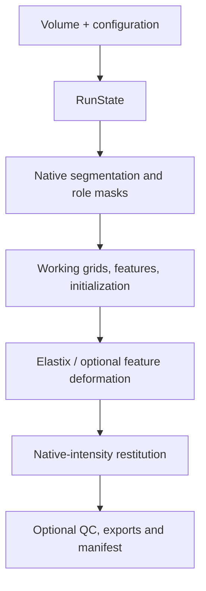

# Regix architecture

This guide is for developers changing registration behaviour. The public flow lives in
`RegistrationPipeline`, while domain operations stay in focused modules and exchange
typed state.

## Boundaries

| Area | Modules | Contract |
|---|---|---|
| Configuration | `config.py`, `presets/` | Pydantic models reject unknown keys and invalid ranges; preset inheritance preserves explicit `null` |
| Input/output | `io/`, `layout.py` | DICOM/NIfTI become `Volume`; paths are kept out of serialised artifacts; output names and cleanup are centralized |
| Geometry/intensity | `preprocess/` | Physical coordinates and direction cosines are authoritative; delivered intensities remain native |
| Organs | `organs/` | `OrganSegmentation` resolves all labels for a name; `Mask` carries an explicit role |
| Features | `features/` | Optional consumer-specific normalization; imports are lazy; MIND is the CPU fallback |
| Registration | `registration/` | Complete `ParamContext`, explicit initialization, staged elastix chain, unified transform loading/application |
| QC | `qc/` | Typed metric reports, independent measurements, explicit gates, escaped deterministic report |
| Interfaces | `cli.py`, `api.py` | Validate untrusted strings/paths, translate domain failures into stable machine or human output |

## Data and control flow



`RunState` exists for one call only. It holds native and working volumes, role-bearing
masks, feature channels, initialization, engine outcome, applied transform, and output.
Free steps such as `step_native_masks`, `step_work_masks`, and
`param_context_from_state` make dependencies explicit and independently testable. A
`RegistrationPipeline` may be reused: neither caller-provided `Volume` metadata nor the
configuration is mutated, and run products are not retained on the instance.

The orchestrator remains intentionally linear because ordering is safety-relevant:
segmentation must see native intensities, initialization must see undilated masks, and
restitution must use the original moving volume. Extract a new step when it has a clear
input/output contract; do not hide ordering in mutable instance attributes.

### Standalone and embedded lifecycles

`run()` and `compute()` share `_run_inner`; there is no second registration algorithm
to drift. A three-boolean internal execution policy only controls lifecycle boundaries:

| Entry point | Persistent artifacts | Registered image | QC |
|---|---:|---:|---:|
| `run()` | configured outputs, report and manifest | yes | configuration |
| `compute()` | none | optional | optional; requires the image |

Elastix requires stage parameter files, so embedded execution uses an automatically
deleted temporary directory rather than claiming to perform zero disk I/O. Before that
directory disappears, file-backed transforms are converted to an owned SimpleITK
transform (or an owned displacement transform as fallback). Returned results therefore
contain no temporary paths and remain usable for resampling and point transport.

## Core invariants

### Geometry

- Images are three-dimensional after loading. A 4D input yields its first complete 3D
  time point; 2D and unsupported dimensions are refused.
- Spacing, origin, and direction define the grid. Grid comparisons use the shared
  geometry helper, not array shape alone.
- Field-of-view overlap uses oriented physical corners, not axis-aligned boxes in index
  space.
- Masks are resampled with nearest-neighbour interpolation. Continuous images use the
  interpolation selected for their purpose.
- Landmarks are physical millimetres. Elastix `index` point files are refused unless a
  caller first converts them with the matching reference image.

### Intensities

Preprocessing may clip but does not rescale the acquisition values supplied to elastix
by default. Feature extractors and segmentation networks prepare their own copies.
Final restitution always samples the native moving image onto the native fixed grid.

Consumer-specific preparation stays inside the consumer. Anatomix and MIND may window
and normalize their feature inputs; this never changes the intensity images used by an
intensity metric or the delivered volume. This boundary prevents an internal elastix
pixel type such as `short` from rounding globally normalized values to 0 or 1. A
measured regression of that form produced a near-zero metric and no optimizer movement;
`qc.gates.min_abs_final_metric` now rejects the degenerate stage independently of its
reported completion status.

### Mask roles

`Mask.role` distinguishes:

- `initialization`: undilated anatomy used for centroids or moments;
- `criterion`: optionally dilated support supplied to the optimizer;
- `qc`: independently propagated masks used for overlap measurements.
- `body`: the native automatic fallback mask.

ROI cropping is a separate physical box planned from an organ/body mask; it is not a
fourth interchangeable mask image.

A body mask is thresholded once at native resolution, converted to a binary 4 mm grid
for physical morphology, and resampled as needed. Role changes create a new object; a
criterion mask is never silently reused as an initialization prior.

### Transform convention

The applied contract maps moving physical points to fixed physical points. Exported
linear matrices therefore mean:

```text
p_fixed = M @ p_moving
```

`AppliedTransform` owns point mapping, image resampling, inversion availability, and
conversion to SimpleITK. `load_transform` accepts Regix ITK `.tfm`, Insight
`.itk.txt`, HDF5, and elastix parameter chains. Insight and elastix text files have
different suffixes so callers never have to guess their grammar.

When ITK converts an elastix transform, probes are generated from the actual fixed
grid: center plus inset corners. A conversion that evaluates no point is an error, not
a successful no-op. Composition returns independent transform objects so callers cannot
mutate an input through the result.

## Registration stages

### Engine boundary

Recent official SimpleITK wheels do not bundle SimpleElastix. Regix therefore uses the
binding maintained by the elastix authors, `itk-elastix`, for optimization and
SimpleITK for DICOM I/O, morphology, runtime transforms, metrics and resampling. The
bridge between them is covered by physical-point probes and rejects a conversion that
evaluates no point.

### Initialization and organ profiles

Initialization modes are explicit: `identity`, `geometry`, `moments`,
`organ_centroid`, `organ_moments`, and `multistart`. If the user requests one candidate,
its failure is fatal. In `multistart`, failed alternatives may be dropped only when at
least one valid candidate remains; the initialization report records requested and
selected modes. Multimodal candidates are scored with NMI and monomodal candidates with
NCC, independently of the first optimization stage.

`organs/labels.py` stores per-organ deformability, grid scale, intensity window, mask
margin and expected motion. Multiple targets resolve to the most constraining compatible
profile. These values are registration priors, not a claim that the segmentation is a
deliverable or ground truth.

### Modality-invariant descriptors

Feature extraction and registration remain separate operations. A descriptor produces
co-registered channel images on each volume; elastix still searches the transformation.

Anatomix is a pretrained 3D U-Net whose 16 channels are intended to preserve anatomy
across randomized contrast. Regix fits one PCA projection shared by the fixed and moving
feature samples, applies that same basis to both volumes, and supplies corresponding
components as cross-correlation metrics. A shared basis is essential: two independent
PCAs could reorder or reverse components and make channel-wise comparison meaningless.

MIND-SSC is the analytical CPU fallback. It describes each voxel through 12 normalized
patch self-similarities in its six-neighbourhood. It needs no learned weights and is
deterministic, but its local context is less discriminative in homogeneous or repeated
anatomy than a learned representation.

Descriptor demand and provider selection are separate. `features.enabled=false`
disables descriptor production, `auto` requests it only for a multimodal pair or a
configured feature-dependent stage, and `true` requests it explicitly. Once requested:

- `provider=auto` preserves the established Anatomix -> MIND-SSC -> intensity chain;
  every unavailable or failed provider is recorded in warnings and the manifest;
- `provider=anatomix` is strict: availability, device, weights and execution errors are
  fatal rather than silently changing the representation;
- `provider=mind` enters MIND-SSC directly and never imports or initializes Anatomix,
  torch or a GPU; failures are fatal rather than changing to intensities;
- `allow_cpu` only authorizes Anatomix CPU inference. MIND is intrinsically CPU-based.

`variant` remains solely the Anatomix checkpoint architecture. The result and manifest
record the requested provider, effective descriptor and fallback chain independently.
Historical configurations without `provider` default to `auto`.

The automatic metric policy is deliberately conservative:

- monomodal intensity stages use NCC;
- multimodal rigid/affine intensity stages use Mattes mutual information;
- configured feature stages use the selected provider when descriptors are available;
- in provider auto, unavailable Anatomix falls back to MIND-SSC rather than disabling
  multimodal support;
- QC records NCC and NMI independently so a feature-stage gain cannot hide an intensity
  degradation.

Optional feature and segmentation packages are imported only inside their execution
paths. Installing torch without Anatomix does not remove MIND, and an `ImportError`
raised inside an installed backend is preserved as a backend failure instead of being
misreported as a missing package.

### Custom parameter files

Every stage receives a complete `ParamContext`. A custom parameter file remains
authoritative for its optimizer, sampler, pyramids, schedules, bins, internal pixel
types and metric weights. Four values are re-imposed because honouring another value
would break the pipeline contract rather than merely tune the optimization:

| Key | Required value | Pipeline contract |
|---|---|---|
| `UseDirectionCosines` | `true` | Physical orientation, including oblique acquisitions |
| `HowToCombineTransforms` | `Compose` | Stage chaining and exported moving-to-fixed matrix |
| `AutomaticTransformInitialization` | `false` | Regix owns and reports initialization |
| `WriteResultImage` | `false` | Regix restores native intensities itself |

A declared stage type that disagrees with the file's transform and an image dimension
mismatch are refused. Other values elastix can safely default are logged. Parameter
snapshots and transform chains are copied defensively so a secondary export failure
degrades the manifest rather than discarding a valid registration.

### Measured elastix integration constraints

- For multi-metric registration, elastix expects one image per metric. A regularization
  penalty is a metric without image content, so Regix duplicates channel zero to satisfy
  the engine's input count.
- `SetExternalInitialTransform` cannot provide the spatial Jacobian required by
  deformation penalties; stages are chained through `-t0` parameter files.
- Elastix 5 uses `InitialTransformParameterFileName` while older configurations may use
  the plural spelling. Regix writes both to prevent a silently detached chain.
- `RequiredRatioOfValidSamples` is 0.05 because partial fields of view are a primary use
  case and the elastix default can reject them before optimization.
- `GetCombinationTransform()` is converted once to an owned SimpleITK transform. Its
  verified conversion lets restitution, point transport, inversion and Jacobian work
  without a second transformix execution.

## QC and artifacts

QC receives the finished `RunState` rather than a long list of unrelated optionals.
Metric dictionaries are checked against small schemas before gates consume them.
Unavailable measurements are represented by absence/`None`, never non-standard JSON
`NaN`. With QC disabled the verdict is `NOT_EVALUATED`.

Displacement and Jacobian statistics use analytical linear paths when possible. Dense
fields are materialized only for nonlinear transforms. The organ profile supplies an
advisory physiological displacement ratio unless a site configures an explicit gate;
rigid organs receive a hard deformation check.

`layout.py` is the source of truth for owned output names. `--overwrite` removes only
those known artifacts and preserves user notes. The manifest inventory is sorted,
relative, strict JSON, and free of input paths. HTML values are escaped, deterministic,
and figures default to compact WebP or external sidecars when configured.

`regix qc OUT_DIR` reads the saved metrics/configuration and re-evaluates gates without
running registration. This is the deliberate boundary between expensive computation and
policy review.

## Dependency direction

Low-level geometry, I/O, and configuration modules do not import the pipeline. QC does
not invoke registration. The registration package lazily exposes its engine so importing
lightweight transform/configuration helpers does not initialize ITK-elastix or optional
GPU libraries. Keep new optional dependencies behind a narrow adapter and a matching
extra in `pyproject.toml`.
